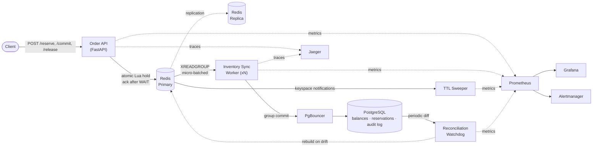

# Distributed Inventory & Order Reservation Engine

[](https://github.com/oscaroguledo/distributed-inventory-engine/actions/workflows/ci.yml)


A high-concurrency order reservation engine that guarantees stock is never
oversold — even under a hold storm on a single low-stock SKU — while
sustaining high request throughput. Redis is used as an atomic, low-latency
*hold engine*; PostgreSQL is the durable, replayable *ledger*. Every
reservation moves through an explicit two-phase lifecycle (reserve → commit
or release), not a single unguarded decrement.

## Core guarantee

At every point during concurrent `reserve` / `commit` / `release` traffic
against a SKU:

```
total_stock == available + sum(active holds) + sum(committed)
```

and `available` never goes negative. This invariant is asserted by a
required CI job that fires thousands of concurrent requests at a low-stock
SKU and fails the pipeline if it's ever violated — not just checked in a
one-off demo.

## Architecture



| Component | Role |
|---|---|
| **Order API** | FastAPI ingestion layer — token-bucket rate limiting, `/reserve` `/commit` `/release` |
| **Redis (primary + replica)** | Atomic hold engine — one Lua script checks/decrements `available`, sets a TTL hold, and appends the event to a stream in a single round trip; `WAIT` bounds durability to a replica ack |
| **Inventory Sync Worker** | Consumes the Redis stream via a consumer group, batches events, and flushes them to Postgres |
| **TTL Sweeper** | Subscribed to Redis keyspace notifications — restores stock automatically when an unclaimed hold's TTL expires |
| **PostgreSQL (via PgBouncer)** | Durable ledger — `inventory_balances`, `inventory_reservations`, an append-only `stock_audit_ledger` |
| **Reconciliation Watchdog** | Periodically diffs Redis's live counters against the Postgres ledger and can rebuild Redis from it on drift |

## Order lifecycle

- **`POST /reserve`** — one atomic Lua script checks `available >= qty`,
  decrements it, sets `hold:{reservation_id}` with a TTL, and appends the
  event to the stream — idempotent on the client-supplied `reservation_id`.
- **`POST /commit`** — called on payment success. Converts the hold into a
  permanent decrement and appends a `committed` event.
- **`POST /release`** — called on cancellation, or automatically by the
  sweeper when a hold's TTL expires. Returns held stock to `available`.

A single `reservation_id`, generated at the API, is propagated through the
Lua event payload, the stream message, and the Postgres row — and through
an OpenTelemetry trace context — so one request is traceable end-to-end
across services, not just within one.

## Tech stack

- **API**: FastAPI, Uvicorn, Pydantic
- **Hold engine**: Redis 7 (Lua scripting, Streams, keyspace notifications, replication)
- **Ledger**: PostgreSQL 16, SQLAlchemy (async), asyncpg, PgBouncer
- **Observability**: Prometheus, Grafana, Alertmanager, OpenTelemetry, Jaeger, `redis_exporter`, `postgres_exporter`
- **CI**: GitHub Actions — lint, unit tests (90% coverage gate), and a full-stack concurrency load test

## Getting started

### Prerequisites

- Docker and Docker Compose
- Python 3.10+ (for running tests locally, outside Docker)

### Run the full stack

```bash
git clone https://github.com/oscaroguledo/distributed-inventory-engine.git
cd distributed-inventory-engine
cp .env.example .env
docker compose up -d --build
```

Confirm it's healthy:

```bash
curl http://localhost:8000/health
```

### Seed a SKU

There's no seed endpoint yet — a fresh stack has no stock for any SKU, so
`/reserve` returns `404 unknown sku` until both stores are provisioned
directly (Redis is what `/reserve` actually checks; the Postgres row is
what the worker's recompute and the reconciliation watchdog track it
against):

```bash
docker compose exec -T postgres psql -U inventory -d inventory -c \
  "INSERT INTO inventory_balances (sku, name, total_stock, available) VALUES ('WIDGET-1', 'Widget', 100, 100) ON CONFLICT (sku) DO NOTHING;"

docker compose exec -T redis redis-cli SET stock:WIDGET-1:available 100
```

### Try a reservation

```bash
RID=$(python3 -c "import uuid; print(uuid.uuid4())")

curl -X POST http://localhost:8000/reserve \
  -H "Content-Type: application/json" \
  -d "{\"sku\":\"WIDGET-1\",\"quantity\":1,\"reservation_id\":\"$RID\"}"

curl -X POST http://localhost:8000/commit \
  -H "Content-Type: application/json" \
  -d "{\"reservation_id\":\"$RID\"}"
```

## API reference

| Method | Path | Description |
|---|---|---|
| `POST` | `/reserve` | Hold stock for a SKU against a client-supplied `reservation_id` |
| `POST` | `/commit` | Convert a held reservation into a permanent decrement |
| `POST` | `/release` | Cancel a held reservation and return stock to `available` |
| `GET` | `/health` | Liveness/readiness — checks Postgres and Redis connectivity |
| `GET` | `/metrics` | Prometheus scrape endpoint |

## Observability

Once the stack is running (default ports from `.env.example`):

| Service | URL | Purpose |
|---|---|---|
| Grafana | http://localhost:3000 | Pre-provisioned dashboard covering request/latency, `WAIT` timeouts, consumer lag, sweeper and watchdog activity |
| Prometheus | http://localhost:9090 | Metrics and alert rule status |
| Alertmanager | http://localhost:9093 | Alert routing |
| Jaeger | http://localhost:16686 | Distributed traces — a single trace spans the API request and the worker's async processing of the same `reservation_id` |

Four alert rules map directly to the system's correctness guarantee:
reconciliation drift, consumer-group lag, `WAIT` timeout spikes, and
sweeper lag.

## Testing

```bash
pip install -r requirements-dev.txt
ruff check .
pytest
```

The unit test suite enforces 90%+ coverage. The concurrency correctness
load test runs against a live Docker Compose stack and is a required CI
step, not a manual demo:

```bash
docker compose up -d --build
PYTHONPATH=. python tests/load/concurrency_correctness.py
```

## CI

Every push to `main` or `staging`, and every pull request, runs three
required jobs in sequence: `lint` (ruff), `test` (pytest, coverage-gated),
and `load-test` (brings up the full Docker Compose stack and asserts the
correctness invariant under concurrent load).

## Project structure

```
order_api/
├── core/           # config, db clients, Lua scripts, metrics, tracing, rate limiter
├── models/         # SQLAlchemy models (balances, reservations, audit log)
├── routes/         # FastAPI routers (order, health)
├── schemas/        # Pydantic request/response schemas
├── services/        # OrderService — the reserve/commit/release business logic
├── main.py          # FastAPI app
├── worker.py         # Inventory sync worker (stream consumer)
├── sweeper.py         # TTL sweeper
└── watchdog.py         # Reconciliation watchdog
tests/
├── load/             # Concurrency correctness load test
└── ...                # Unit tests mirroring the order_api/ layout
prometheus/, alertmanager/, grafana/   # Observability stack configuration
```
